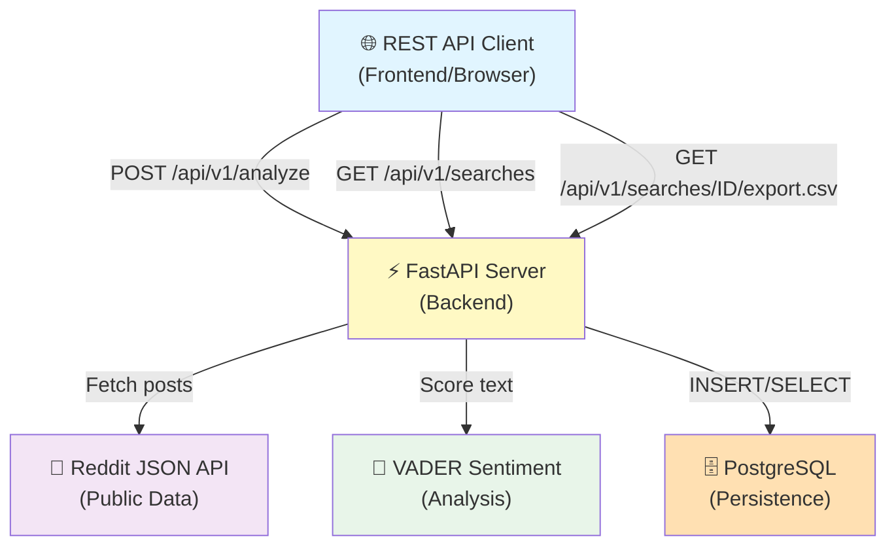

# System Architecture Diagram

```mermaid
graph TB
    Client["🌐 REST API Client<br/>(Frontend/Browser)"]
    FastAPI["⚡ FastAPI Server<br/>(Backend)"]
    Reddit["🔗 Reddit JSON API<br/>(Public Data)"]
    NLP["🧠 VADER Sentiment<br/>(Analysis)"]
    DB["🗄️ PostgreSQL<br/>(Persistence)"]
    
    Client -->|POST /api/v1/analyze| FastAPI
    Client -->|GET /api/v1/searches| FastAPI
    Client -->|GET /api/v1/searches/ID/export.csv| FastAPI
    
    FastAPI -->|Fetch posts| Reddit
    FastAPI -->|Score text| NLP
    FastAPI -->|INSERT/SELECT| DB
    
    style Client fill:#e1f5ff
    style FastAPI fill:#fff9c4
    style Reddit fill:#f3e5f5
    style NLP fill:#e8f5e9
    style DB fill:#ffe0b2
```

