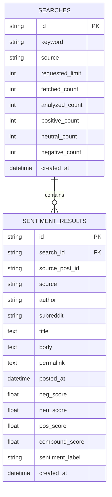

# Database Schema Diagram

## Entity-Relationship Model

```mermaid
erDiagram
    SEARCHES ||--o{ SENTIMENT_RESULTS : contains
    
    SEARCHES {
        string id PK
        string keyword
        string source
        int requested_limit
        int fetched_count
        int analyzed_count
        int positive_count
        int neutral_count
        int negative_count
        datetime created_at
    }
    
    SENTIMENT_RESULTS {
        string id PK
        string search_id FK
        string source_post_id
        string source
        string author
        string subreddit
        text title
        text body
        text permalink
        datetime posted_at
        float neg_score
        float neu_score
        float pos_score
        float compound_score
        string sentiment_label
        datetime created_at
    }
```

