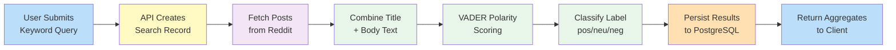

# Data Flow Process Diagram

## Sentiment Analysis Pipeline

```mermaid
graph LR
    A["User Submits<br/>Keyword Query"] --> B["API Creates<br/>Search Record"]
    B --> C["Fetch Posts<br/>from Reddit"]
    C --> D["Combine Title<br/>+ Body Text"]
    D --> E["VADER Polarity<br/>Scoring"]
    E --> F["Classify Label<br/>pos/neu/neg"]
    F --> G["Persist Results<br/>to PostgreSQL"]
    G --> H["Return Aggregates<br/>to Client"]
    
    style A fill:#bbdefb
    style B fill:#fff9c4
    style C fill:#f3e5f5
    style D fill:#e8f5e9
    style E fill:#e8f5e9
    style F fill:#e8f5e9
    style G fill:#ffe0b2
    style H fill:#bbdefb
```

